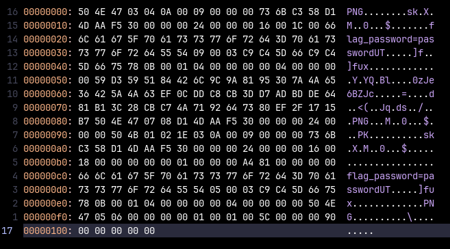

# broken file

## Initial probing

`file image.jpg` returns `image.jpg: data`. This at least tells us that `image.jpg` is not a JPG file.

## Hex content

The following is the hex of `image.jpg`, as viewed in Neovim:

