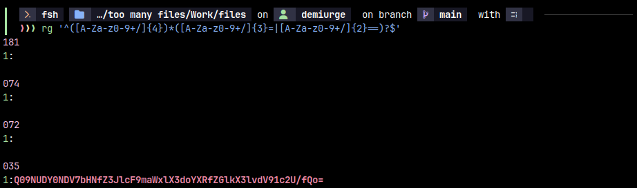
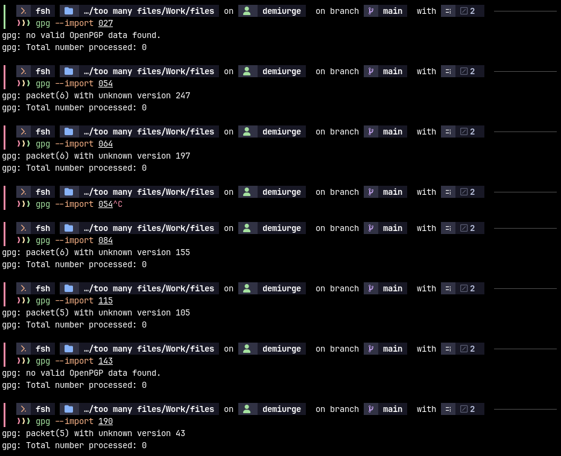

# too many files


## binwalk


Binwalk just says there are 200 'Zip archive data'

## unzip


Unzipping yields a lot of `data` files, except for:

- `006: Dyalog APL version -46, -38`
- `027: OpenPGP Secret Key`
- `033: DOS executable (COM), start instruction 0xb8515b88 50e70dba`
- `035: ASCII text`
- `054: OpenPGP Public Key`
- `064: OpenPGP Public Key`
- `084: OpenPGP Public Key`
- `103: Non-ISO extended-ASCII text, with NEL line terminators`
- `115: OpenPGP Secret Key`
- `143: OpenPGP Public Key`
- `190: OpenPGP Secret Key`

### 035 ASCII text

#### Testing for base64

Using ripgrep to pattern match for base64 files results in the following:

```bash
rg '^([A-Za-z0-9+/]{4})*([A-Za-z0-9+/]{3}=|[A-Za-z0-9+/]{2}==)?$'
```



This indicates that `035` may be base64-decodable.

#### Decrypting by base64
The file `035` contains the following content:

```
Q09NUDY0NDV7bHNfZ3JlcF9maWxlX3doYXRfZGlkX3lvdV91c2U/fQo=
```

Decrypting it via `base64 -d 035` yields:

```
COMP6445{ls_grep_file_what_did_you_use?}
```

### OpenPGP keys


These are keys for public-key cryptography, which can be used to decrypt/encrypt data or sign them (to prove your identity in a cryptographic manner).

It's weird that there are 3 secret keys but 4 public keys, as they're supposed to come in pairs.

The keys generally come with identities, so it may be worth looking at that.

None of them seems to be importable though. Running `gpg --import` on them yields the following result:


