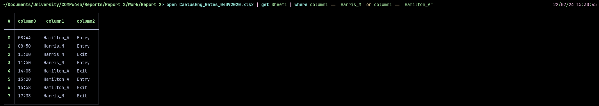

# Gate logs

Using [NuShell](https://github.com/nushell/nushell) to filter the logs to show only entries relevant to either [Michael Harris](<./People/Michael Harris.md>) or [Alyx Hamilton](<./People/Alyx Hamilton>), the following can be found:

The exit time of Alyx Hamilton (16:58) corroborates David Caelus' account that her laptop did not leave the Caelus Engineering's network until after 5pm:

> **To:** info@jimsforensics.com
>
> **From:** david.caelus@caelusengineering.com.au
>
> **Date:** 24 October 2021
>
> **Subject:** Fw: Re: Assistance request
>
> ...
> I have spoken to our IT person Sam and she was able to pull some more data for us - I have the work emails of Alyx, and Michael; and I have the internet traffic from that machine from the afternoon in question. Seems like the device didn't leave our network until after 5pm.

However, this does not necessarily imply that Alyx brought her laptop with her when she left the premises; another possible scenario is for her to have left the premises without her laptop, and the device being disconnected from the network around the same time (whether intentionally by a person or otherwise). If the latter were the case and it was caused by someone's deliberate actions, it may indicate an intent to frame Alyx for the disappearance and disposal of the laptop. That person would need to be within proximity of Alyx during the time of her exit to both be informed of her exit and promptly access her laptop.

## Time zone

The time zone is not specified. However, given that the company is headquartered in Adelaide, it can be assumed that the time zone of the logs is ACST.
