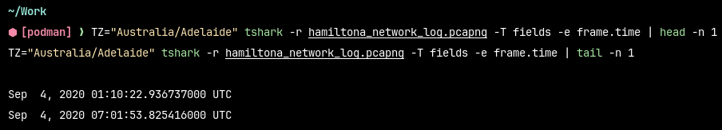

# Network capture

## Time span

The time span covered by the provided `pcapng` file can be obtained using the following command:

```sh
TZ="Australia/Adelaide" tshark -r hamiltona_network_log.pcapng -T fields -e frame.time | head -n 1
TZ="Australia/Adelaide" tshark -r hamiltona_network_log.pcapng -T fields -e frame.time | tail -n 1
```

which yields:



## Alyx Hamilton's lunch with Sarah Jenkins

Alyx Hamilton left the premises at 14:05 to 15:20, which coincides with her lunch plan scheduled with Sarah Jenkins that is found on her email correspondence. This leaves Michael Harris, who entered the premises at 11:50 and later leaves at 17:33, potentially alone with her laptop (assuming that she did not bring her laptop with her), which is not password protected.

Wireshark filter (adjusted for the time difference between Adelaide and Sydney):

```
frame.time >= "2020-09-04 14:35:00" && frame.time <= "2020-09-04 15:50:00"
```
