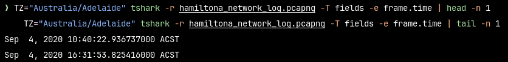

# Network capture

## Time span

The time span covered by the provided `pcapng` file can be obtained using the following command:

```sh
TZ="Australia/Adelaide" tshark -r hamiltona_network_log.pcapng -T fields -e frame.time | head -n 1
TZ="Australia/Adelaide" tshark -r hamiltona_network_log.pcapng -T fields -e frame.time | tail -n 1
```

which yields:


